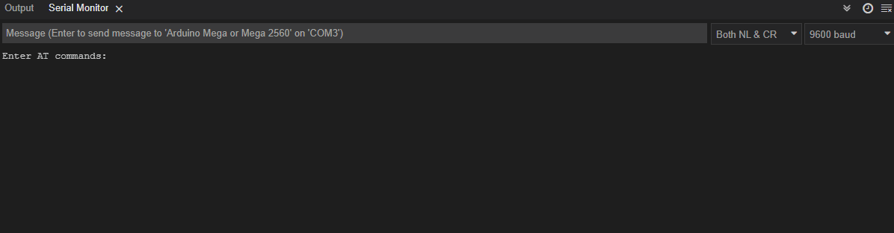

# Arduino Mega & HM-10 Bluetooth Module

## About

Maybe this will help someone struggling with setting up **Arduino Mega2560** with **HM-10 Bluetooth module**.

I bought my Bluetooth module from Amazon and apparently it seems to be 'clone' even though it has the Texas Instruments CC2541 chip, which is used in the 'original' module from Jinan Huamaoand(?). I did not have to upload original firmware to make this module work.

I started experiment with [4ntoine mega-to-hm10](https://github.com/4ntoine/mega-to-hm10) repository to setup the connection.

Unfortunately pins `TX14, RX15` or `TX18 & RX19` did not work for me.

Had the same issue like many others have had before where AT commands do not work in serial mode.

### Arduino documentation

It seems some documentation is inconclusive within Arduino website about **RX** pins?

Within [SoftwareSerial](https://docs.arduino.cc/learn/built-in-libraries/software-serial#print) library documentation it is stated that:

* Not all pins on the Mega and Mega 2560 boards support change interrupts, so only the following can be used for RX: 10, 11, 12, 13, 14, 15, 50, 51, 52, 53, A8 (62), A9 (63), A10 (64), A11 (65), A12 (66), A13 (67), A14 (68), A15 (69). Not all pins on the Leonardo and Micro boards support change interrupts, so only the following can be used for RX: 8, 9, 10, 11, 14 (MISO), 15 (SCK), 16 (MOSI).

And within [SoftwareSerialExample](https://docs.arduino.cc/tutorials/communication/SoftwareSerialExample) it is stated:

* Not all pins on the Mega and Mega 2560 support change interrupts,
 so only the following can be used for RX:
 10, 11, 12, 13, 50, 51, 52, 53, 62, 63, 64, 65, 66, 67, 68, 69

### My solution

|HM-10   | Arduino Mega  |
|---|---|
| GND   | GND     |
| TXD   | PIN 10  |
| RXD   | PIN 14  |

My solution was to use pin `10` for RX. I assume that 11, 12 and 13 would work also.

Example code for testing serial mode and AT commands can be found within `at.ino` file.

### Disclosure

I am beginner with **Arduino**.
Hence, it is possible that due to my own mistake I did not get RX to work with other pins, eg. `15` or `19` in the beginning.
